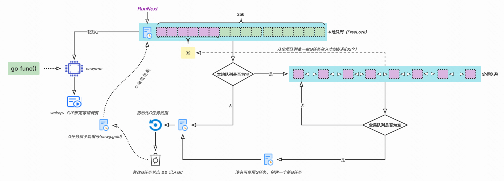

# G

编译器将 `go func()` 翻译为`newproc`调用，目标函数及其参数被打包成`funcval`结构对象。

```go
// main.go

func test(x int, p *int) {
    println(x, *p)
}

func main() {
    x := 111
    y := 222

    go test(x, &y)
}
```

```bash
$ go build -gcflags "-S"

"".main STEXT size=139 args=0x0 locals=0x20 funcid=0x0 align=0x0	

    # 逃逸到堆上的y
    LEAQ	type.int(SB), AX
    CALL	runtime.newobject(SB)
    AX, "".&y+16(SP)
    $222, (AX)

    # 打包目标函数和参数
    LEAQ	type.noalg.struct { F uintptr; ""..autotmp_2 int; ""..autotmp_3 *int }(SB), AX
    CALL	runtime.newobject(SB)

    # funcval.fn --> func1 --> test
    LEAQ	"".main.func1(SB), CX
    MOVQ	CX, (AX)

    # funcval.x
    MOVQ	$111, 8(AX)
    
    # funcval.p -> &y
    MOVQ	"".&y+16(SP), CX
    MOVQ	CX, 16(AX)

    CALL runtime.newproc(SB)


"".main.func1 STEXT size=76 args=0x0 locals=0x18 funcid=0x15 align=0x0
    MOVQ	16(DX), BX
    MOVQ	8(DX), AX
    CALL	"".test(SB)


"".test STEXT size=113 args=0x10 locals=0x20 funcid=0x0 align=0x0
    # x
    MOVQ	AX, ""..autotmp_3+16(SP)

    # *p
    MOVQ	(BX), CX
    MOVQ	CX, ""..autotmp_4+8(SP)

    MOVQ	""..autotmp_3+16(SP), AX
    CALL	runtime.printint(SB)
	
    MOVQ	""..autotmp_4+8(SP), AX
    CALL	runtime.printint(SB)
```

了解打包流程后，如下代码就好理解了。



```go
// runtime2.go

type funcval struct {
    fn uintptr
    // variable-size, fn-specific data here
}
```

```go
// proc.go

// Create a new g running fn.
// Put it on the queue of g's waiting to run.
// The compiler turns a go statement into a call to this.

func newproc(fn *funcval) {
    gp := getg()
    
    // 获取 go func 下一条指令位置。
    pc := getcallerpc()
    
    systemstack(func() {
        newg := newproc1(fn, gp, pc)

        // 获取的g放入本地队列。
        _p_ := getg().m.p.ptr()
        runqput(_p_, newg, true)        

        // 如果 main G 启动完毕，则唤醒其他MP执行任务
        if mainStarted {
            wakep()
        }
    })
}
```

取一个`G`对象(复用或新建)，初始化自带栈，并在`sched`等字段内记录执行相关信息。

```go
// runtime2.go

type g struct {
    stack           stack
    sched           gobuf
    gopc            uintptr         // pc of go statement that created this goroutine
    startpc         uintptr         // pc of goroutine function
}
```

```go
// proc.go

// Create a new g in state _Grunnable, starting at fn. callerpc is the
// address of the go statement that created this. The caller is responsible
// for adding the new g to the scheduler.
func newproc1(fn *funcval, callergp *g, callerpc uintptr) *g {
    
    // 获取可复用 G, 或新建
    newg := gfget(_p_)
    if newg == nil {
        // 本地队列和全局队列都为空，则创建新 G
        newg = malg(_StackMin)
        casgstatus(newg, _Gidle, _Gdead)
        allgadd(newg)
    }

    // 初始化任务数据
    totalSize := uintptr(4*goarch.PtrSize + sys.MinFrameSize) // extra space in case of reads slightly beyond frame
    totalSize = alignUp(totalSize, sys.StackAlign)
    sp := newg.stack.hi - totalSize

    memclrNoHeapPointers(unsafe.Pointer(&newg.sched), unsafe.Sizeof(newg.sched))
    newg.sched.sp = sp
    newg.stktopsp = sp
    newg.sched.pc = abi.FuncPCABI0(goexit) + sys.PCQuantum // +PCQuantum so that previous instruction is in same function
    newg.sched.g = guintptr(unsafe.Pointer(newg))
    
    gostartcallfn(&newg.sched, fn)
    newg.gopc = callerpc
    newg.startpc = fn.fn

    // 修改状态，并记录 GC
    casgstatus(newg, _Gdead, _Grunnable)
    gcController.addScannableStack(_p_, int64(newg.stack.hi-newg.stack.lo))

    return newg
}
```

&nbsp;

## 编号

在`sched`里有个计数器，用于分配`G.goid`编号。

```go
// runtime2.go

type schedt struct {
    goidgen   uint64
}
```

考虑到多个`P`共同使用，所以每次都提取一段“缓存”到本地。

```go
// proc.go

// Number of goroutine ids to grab from sched.goidgen to local per-P cache at once.
// 16 seems to provide enough amortization, but other than that it's mostly arbitrary number.
_GoidCacheBatch = 16
```

```go
// runtime2.go

type p struct {
    // Cache of goroutine ids, amortizes accesses to runtime·sched.goidgen.
    goidcache    uint64
    goidcacheend uint64
}

type g struct {
    goid         int64
}
```

在`newproc1`里，通过判断本地计数是否达到尾部(`goidcacheend`)来决定是否新取一批过来。

> 就是简单的将 sched.goidgen + 16，表示取走 16 个连续号。这样就保证了多个P之间G.id的唯一性。
> 
> 注意，G对象复用时，会重新赋予id。通过编号，我们大概能判断进程里共计创建过多个任务。

```go
// proc.go

func newproc1(fn *funcval, callergp *g, callerpc uintptr) *g {

    // 复用或新建
    newg := gfget(_p_)
    if newg == nil {
        newg = malg(_StackMin)
        casgstatus(newg, _Gidle, _Gdead)
        allgadd(newg)
    }

    // 初始化相关属性...
    newg.startpc = fn.fn

    casgstatus(newg, _Gdead, _Grunnable)
    gcController.addScannableStack(_p_, int64(newg.stack.hi-newg.stack.lo))

    // 编号缓存不足，从 sched 取一段回来。
    if _p_.goidcache == _p_.goidcacheend {

        // Sched.goidgen is the last allocated id,
        // this batch must be [sched.goidgen+1, sched.goidgen+GoidCacheBatch].
        // At startup sched.goidgen=0, so main goroutine receives goid=1.
        
        _p_.goidcache = atomic.Xadd64(&sched.goidgen, _GoidCacheBatch)
        _p_.goidcache -= _GoidCacheBatch - 1
        _p_.goidcacheend = _p_.goidcache + _GoidCacheBatch
    }
    
    / 赋予新编号。
    newg.goid = int64(_p_.goidcache)
    _p_.goidcache++

    return newg
}
```
