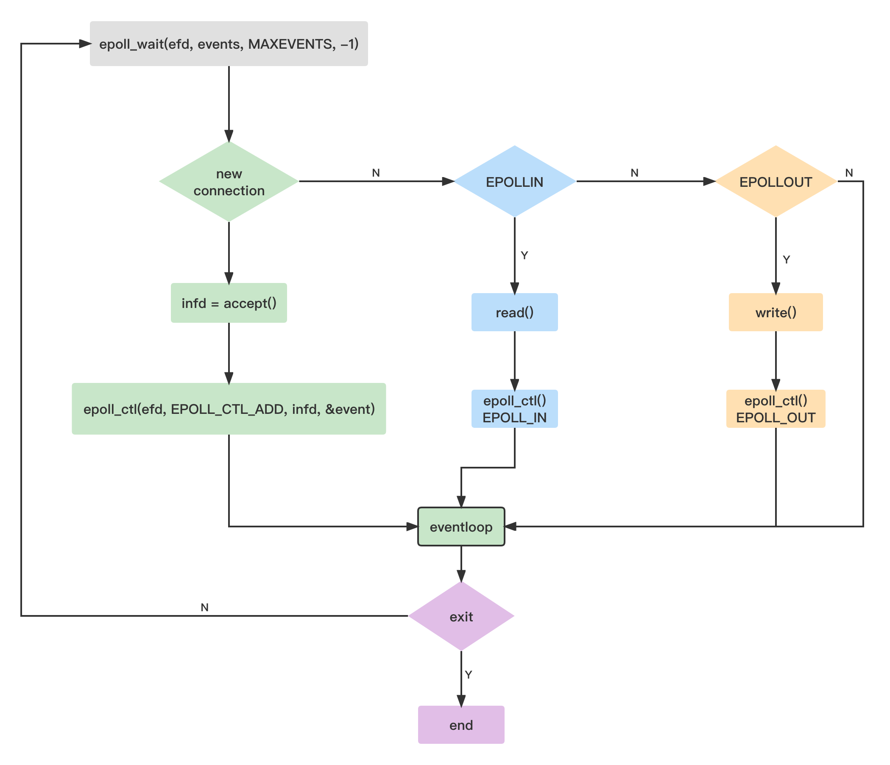

# 网络轮询

## netpoll流程图



&nbsp;

## Go netpoll

基于操作系统 `I/O` 多路复用机制，增强并发处理能力。

* I/O 模型:
    * 阻塞
    * 非阻塞
    * 多路复用

> 多路复用通常用循环处理多个I/O事件，常见的有 Linux/epoll、Darwin/kqueue、Windows/iocp、Solaris/evport等
>
> 多路复用函数阻塞监听一组文件描述符(fd)，当其中某些状态变为可读时，返回个数，获取事件关联描述符(ev.data)。

整体结构是包装系统调用(epoll)，然后在系统监控(sysmon)和调度器(scheduler)循环中轮询(netpoll)。通过发生事件源内的记录(rg、wg)获取目标goroutine，并唤醒。

不同于操作系统使用文件描述符，Go 轮询器使用更复杂的结构。

```go
// netpoll.go

// Network poller descriptor.
type pollDesc struct {
    
    link *pollDesc      // in pollcache, protected by pollcache.lock
    fd   uintptr        // constant for pollDesc usage lifetime
    
    rg   atomic.Uintptr // pdReady, pdWait, G waiting for read or nil
    wg   atomic.Uintptr // pdReady, pdWait, G waiting for write or nil

    closing bool
    
    rseq    uintptr     // protects from stale read timers
    rt      timer       // read deadline timer (set if rt.f != nil)
    rd      int64       // read deadline (a nanotime in the future, -1 when expired)
    
    wseq    uintptr     // protects from stale write timers
    wt      timer       // write deadline timer
    wd      int64       // write deadline (a nanotime in the future, -1 when expired)
}
```

该对象同样被复用。简单的链表结构，提供`alloc`、`free` 方法。

```go
type pollCache struct {
    lock  mutex
    first *pollDesc
}

var pollcache pollCache
```

&nbsp;

### 初始化

标准库内网络(net)、文件(file)、定时器(timer)等都依赖轮询器，会触发初始化操作。

* `src/net/fd_unix.go`：`net.netFD.init`
* `src/os/file_unix.go`：`os.newFile`
* `src/runtime/time.go`：`runtime.doaddtimer`

```go
// src/os/file_unix.go

func newFile(fd uintptr, name string, kind newFileKind) *File {
    
    f := &File{&file{
        pfd: poll.FD{}, ...
    }}

    if err := f.pfd.Init("file", pollable); err != nil {
    }
    
    ...
}
```

```go
// src/internal/poll/fd_unix.go

func (fd *FD) Init(net string, pollable bool) error {
    err := fd.pd.init(fd)
    return err
}
```

```go
// src/internal/poll/fd_poll_runtime.go

func (pd *pollDesc) init(fd *FD) error {
    serverInit.Do(runtime_pollServerInit)
    ctx, errno := runtime_pollOpen(uintptr(fd.Sysfd))
}
```

&nbsp;

初始化所调用函数由 `runtime` 实现。

```go
// netpoll.go

//go:linkname poll_runtime_pollServerInit internal/poll.runtime_pollServerInit
func poll_runtime_pollServerInit() {
    netpollGenericInit()
}
```

```go
var netpollInited uint32

func netpollGenericInit() {
    if atomic.Load(&netpollInited) == 0 {
        if netpollInited == 0 {
            netpollinit()
            atomic.Store(&netpollInited, 1)
        }
    }
}
```

&nbsp;

不同操作系统采用方案有所差异， 以Linux epoll为例。

```go
// netpoll_epoll.go

var (
    epfd int32 = -1                        // epoll descriptor
    netpollBreakRd, netpollBreakWr uintptr // for netpollBreak
)


func netpollinit() {
    
    // 创建 epoll，pipe 通信管道。
    epfd = epollcreate1(_EPOLL_CLOEXEC)
    r, w, errno := nonblockingPipe()
    
    // 将 pipe/r 添加到 epoll 。
    ev := epollevent{ events: _EPOLLIN }
    *(**uintptr)(unsafe.Pointer(&ev.data)) = &netpollBreakRd
    errno = epollctl(epfd, _EPOLL_CTL_ADD, r, &ev)
    
    netpollBreakRd = uintptr(r)
    netpollBreakWr = uintptr(w)
}
```

&nbsp;

事先添加了管道。因此，只要向管道写入数据，就可以引发事件，中断(interrupt)多路复用等操作。

```go
// netpollBreak interrupts an epollwait.
func netpollBreak() {
    if atomic.Cas(&netpollWakeSig, 0, 1) {
        for {
            var b byte
            n := write(netpollBreakWr, unsafe.Pointer(&b), 1)
            if n == 1 {
                break
            }
            if n == -_EINTR {
                continue
            }
            if n == -_EAGAIN {
                return
            }
            println("runtime: netpollBreak write failed with", -n)
            throw("runtime: netpollBreak write failed")
        }
    }
}
```

&nbsp;
