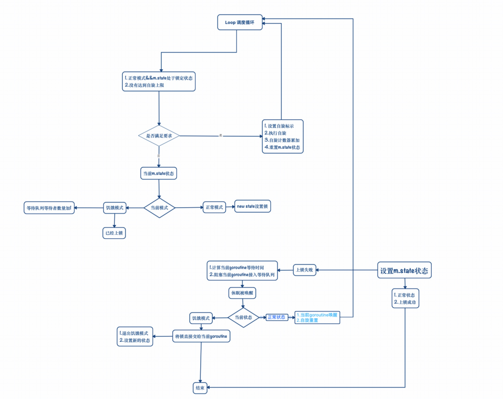

# Mutex

### Mutex概念定义
Mutex是一种用于多线程编程中,防止两个线程同时对同一公共资源进行读写的机制。该目的通过将代码切成一个一个的临界区域达成。临界区域指的是一块儿对公共资源进行访问的代码,并非一种机制或是算法。一个程序、进程、线程可以拥有多个临界区域,但是并不一定会应用互斥锁。


### 使用场景
一段代码(甲)正在修改一块数据。这时，另一条线程(乙)由于一些原因被唤醒。如果乙此时去读取甲正在修改的数据，而甲碰巧还没有完成这个修改过程，这个时候这块儿代码数据的状态就处于极大的不确定状态中，读取到的数据当然也是有问题的。更严重的情况是乙也往这块地方写数据，这样一来，后果将变得不可收拾。因此，多个线程间共享的数据必须被保护。达到这个目的的方法，就是确保同一时间只有一个临界区域处于运行状态，而其他的临界区域，无论是读还是写，都必须被挂起来并且不能获得运行机会。


## Go Mutex源码剖析

Go语言没有使用系统提供的互斥锁，而是在用户空间基于原子操作实现，以便更好地支持并发调度。

互斥锁有两种状态: 正常状态和饥饿状态。

### 正常模式
在正常状态下,所有等待的goroutine按照FIFO顺序等待。唤醒的goroutine不会直接拥有锁，而是会和新请求锁的goroutine竞争锁的所有权。新请求锁的goroutine具有优势(它当前获得了CPU时间片,可能还在持续拥有),所以刚刚唤醒的goroutine有很大可能在锁竞争中失败。在这种情况下,这个被唤醒的goroutine会加入等待队列的前面,等待再次被唤醒。如果一个等待的Goroutine超过1ms没有获得锁，那么它会把锁转换为饥饿模式。

### 饥饿模式
在饥饿模式下，锁的所有权将从unlock的Goroutine直接交给等待队列中的第一个。新请求锁的goroutine将不会尝试获得锁,即便锁处于unlock状态,也不会处于自旋状态，而是直接放到队列的尾部。

如果一个等待的goroutine获得了锁，并且满足了一下其中任何一个条件:

* 它是队列中的最后一个
* 它等待时间小于1ms

它会将锁转换为正常状态。


### Mutex 数据结构
```
// sync/mutex.go
type Mutex struct {
	// state使用二进制标记多个信息:
	// 0 - Locked,表示锁被占用
	// 1 - Woken,表示某个请求处于清醒状态(自旋或因信号量唤醒)
	// 2 - startving, 表明是否处于饥饿状态(0位正常模式；1为饥饿模式)
	// 3 - 31 - 保存等待者数量(state + 1<<mutexWaiterShift)
	state int32             // 当前锁状态
	sema  uint32            // 从等待队列唤醒通知
}
```

```
const (
	mutexLocked = 1 << iota 	// 1, mutex处于锁定状态
	mutexWoken					// 2, mutex处于唤醒状态
	
	// 处于饥饿模式下,unlcok groutine直接分配给下一个等待者(线程).
	// Go1.9 加入饥饿模式,让锁变的更加公平,不公平的等待时间限制在1ms.
	// NOTE: 修复了一个bug,唤醒的goroutine总是放在等待队列尾部会导致更加不公平的等待时间.
	mutexStarving 				// 4, 处于饥饿状态
	mutexWaiterShift = iota		// 5, 当前队列等待数量 
)
```

### Locker
Mutex对外提供的一个接口,表示一个Locker对象可以Lock和Unlock一个对象。

```
type Locker interface {
	Lock()
	Unlock()
}
```

### Lock具体实现


```
// 如果lock已经被用,调用goroutine将被阻塞,直到m可用.
func (m *Mutex) Lock() {
	// Fast path: grab unlocked mutex.
	
	// 快速模式: 使用CAS直接获取锁。这种上锁方式效率很高,为第一次上锁准备的。
	if atomic.CompareAndSwapInt32(&m.state, 0, mutexLocked) {
		return
	}
	
	// 一般模式:
	// 1.12之前版本普通模式直接在此处实现,现在通过lockSlow函数实现。
	// 以确保fast path方式可以被内联。 
	m.lockSlow()
}
```

```
func (m *Mutex) lockSlow() {
	// 标记Goroutine的等待时间
	var waitStartTime int64
	
	// 当前goroutine是否处于饥饿状态
	starving := false
	
	// 当前goroutine是否已经被唤醒
	awoke := false
	
	// 自旋次数
	iter := 0
	
	// 复制锁的当时状态
	old := m.state
	
	for {
		/*
				0001   ==> mutexLocked
			|	0001   ==> mutexStarving
		  ------------
		       0001  => 1(mutexLocked|mutexStarving)
		    &  0001  => 1 old
		  ------------
		       0001  => 1 => mutexLocked
		*/
		
		// 第一个条件: state处于locked,但不处于饥饿状态。
		// 第二个条件: 没有达到自旋上限阈值,还可以进行自旋
		// 满足以上两个条件，继续处于自旋状态等待锁释放、或者进入饥饿状态、或者进入等待队列。
		if old&(mutexLocked|mutexStarving) == mutexLocked && runtime_canSpin(iter) {
			// 设置自旋标志
			if !awoke && old&mutexWoken == 0 && old>>mutexWaiterShift != 0 &&
				atomic.CompareAndSwapInt32(&m.state, old, old|mutexWoken) {
				awoke = true
			}
			
			// 执行自旋,自旋计数器自加,重置m状态
			runtime_doSpin()
			iter++
			old = m.state
			continue
		}
		
		// 保存当前锁m.state状态
		// old是锁当前状态
		new := old
		
		// 1. 如果old.state是正常模式,new state设置锁,尝试通过CAS获取锁。
		// 2. 如果old.state是饥饿模式,则不设置new.state的锁,因为饥饿状态下直接转给等待队列的第一个。
		/*	       
	   正常模式:
	       0001
	     & 0000
	     -------
	       0000
	   或:
	       0000
	     & 0000
	     -------
	       0000
		*/
		if old&mutexStarving == 0 {
			new |= mutexLocked
		}
		
		// 处于饥饿模式或锁定状态时,将等待队列等待之数量加1
		/*
		饥饿模式:
		    0000   => mutexLocked
		  | 0100   => mutexStarving
		  -------
		    0100
		  & 0100   => old
		  -------
		    0100
		
	   正常模式&&锁定状态:
	       0001  => mutexLocked
	     | 0000  => mutexStarving(正常模式)
	     -------
	       0001
	     & 0001  => old
	     -------
	       0001
		*/
		if old&(mutexLocked|mutexStarving) != 0 {
			new += 1 << mutexWaiterShift
		}
				
		// 当前处于饥饿模式下,并且已经上锁了
		// mutexStarving设置为1,接下来CAS会用到
		if starving && old&mutexLocked != 0 {
			new |= mutexStarving
		}
		
		// 如果当前goroutine被唤醒,需要将mutexWoken标示清除
		if awoke {
			if new&mutexWoken == 0 {
				throw("sync: inconsistent mutex state")
			}
			new &^= mutexWoken
		}
		
		
		// 通过CAS设置m.state状态
		if atomic.CompareAndSwapInt32(&m.state, old, new) {
		   // 如果old没有上锁,并且也不是饥饿模式
		   // 上锁成功(CAS模式),直接退出
			if old&(mutexLocked|mutexStarving) == 0 {
				break
			}
			
			// 设置/计算本goroutine的等待时间
			queueLifo := waitStartTime != 0
			if waitStartTime == 0 {
				waitStartTime = runtime_nanotime()
			}
			
			// 如果获取锁失败,阻塞当前goroutine
			// 如果有新创建的goroutine, queueLifo=false, 加入等待队列尾部
			// 如果是唤醒的goroutine, queueLifo=true, 加入等待队列头部
			runtime_SemacquireMutex(&m.sema, queueLifo, 1)
			
			// sleep之后,此goroutine被唤醒
			
			// 计算当前goroutine是否已经处于饥饿状态
			starving = starving || runtime_nanotime()-waitStartTime > starvationThresholdNs
			
			// 当前锁状态
			old = m.state
			
			// 如果当前的state已经是饥饿状态
			// 那么锁应该处于Unlock状态,锁被直接交给当前goroutine
			if old&mutexStarving != 0 {
			
				// 当前goroutine用来设置锁,并将等待的goroutine减1
				delta := int32(mutexLocked - 1<<mutexWaiterShift)
				
				// 如果goroutine是最后一个等待者或者它处于正常模式
				// 将锁的state状态设置为正常模式
				if !starving || old>>mutexWaiterShift == 1 {
					
					// 退出饥饿模式
					delta -= mutexStarving
				}
				
				// 设置新的state
				atomic.AddInt32(&m.state, delta)
				break
			}
			
			// 如果当前锁为正常模式
			// 当前goroutine被唤醒,自旋置0,重新进行调度
			awoke = true
			iter = 0
		} else {
			// 如果CAS不成功,重新获取锁的state
			// 重新调度
			old = m.state
		}
	}
}
```

### Lock流程图




