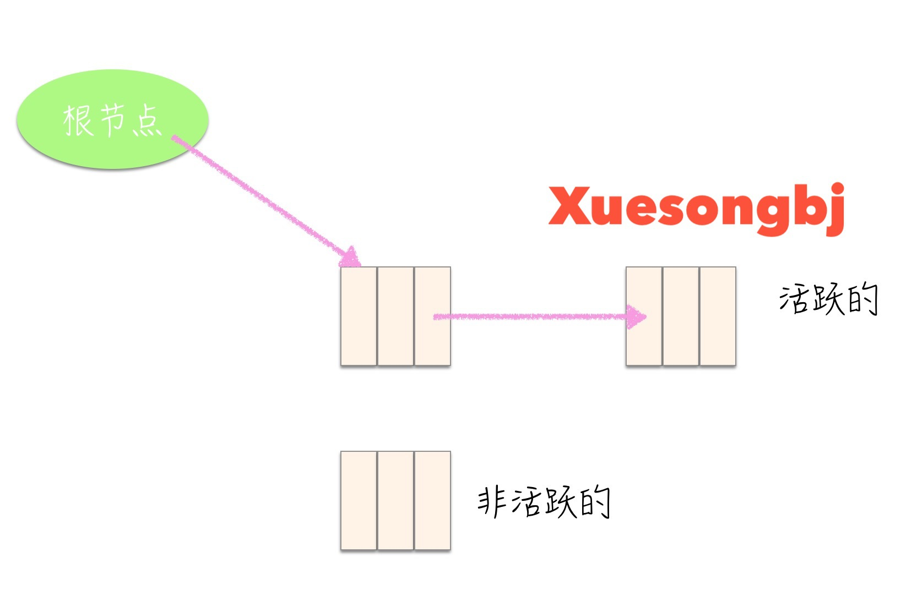
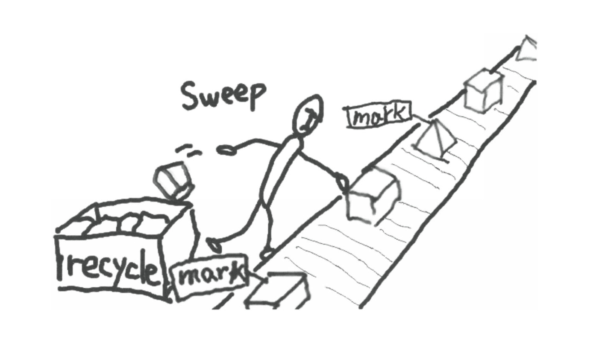
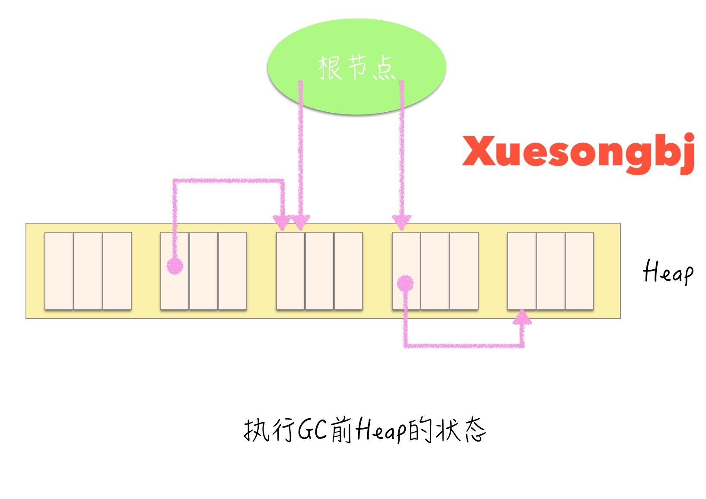
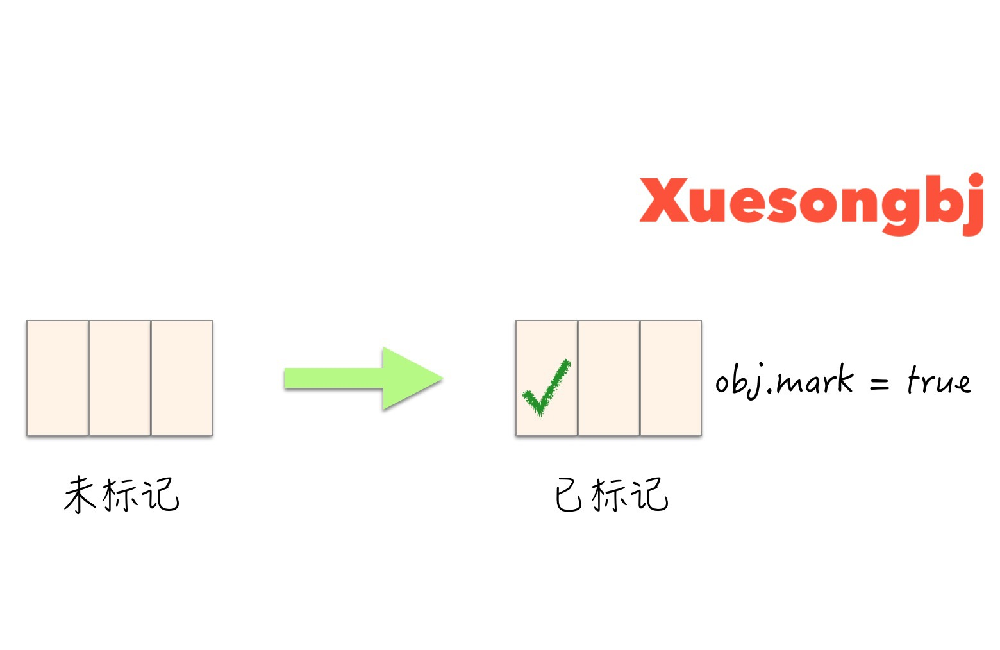
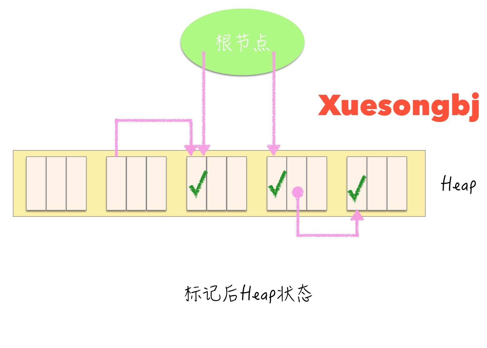
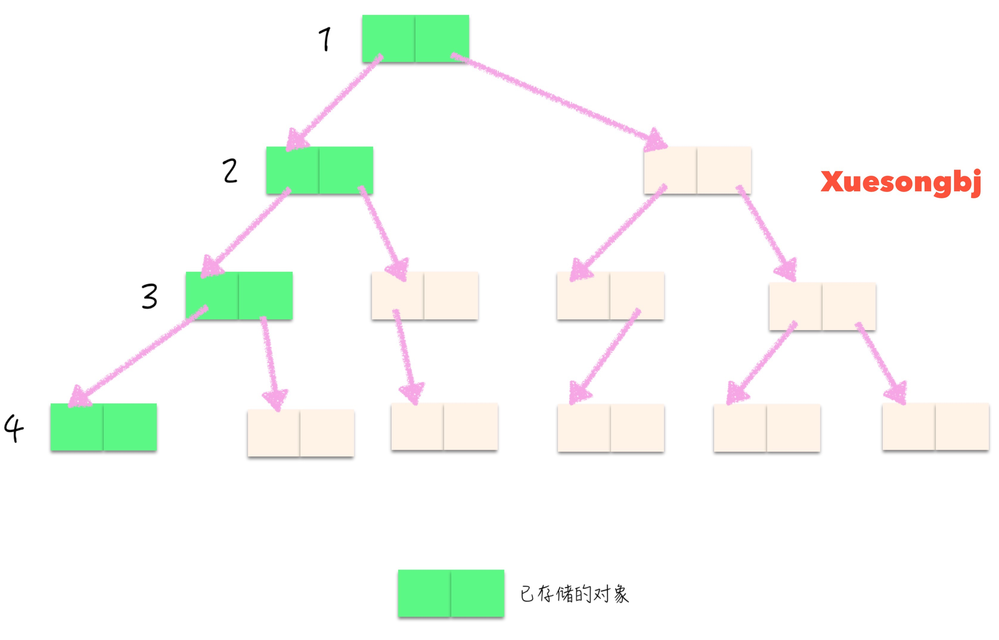
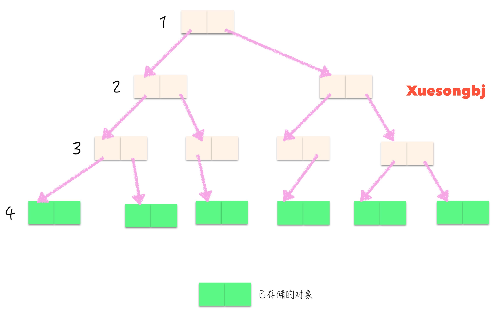
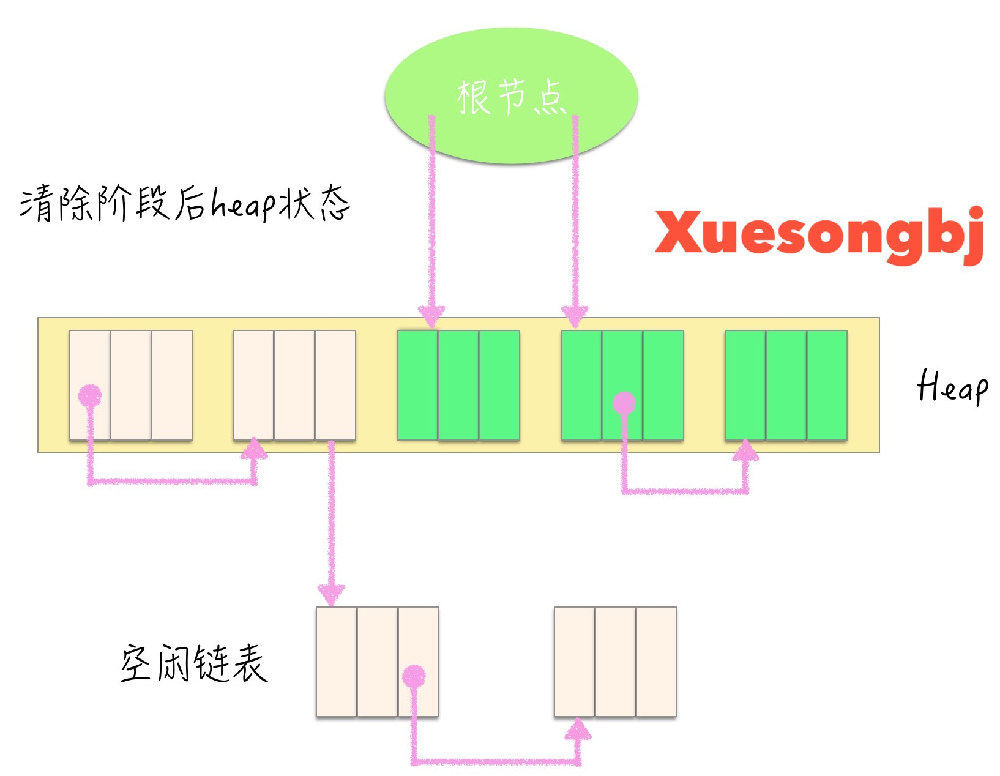

# GC标记-清理算法
GC回收算法有很多种,像引用计数法、分代垃圾回收、GC标记-清理算法等。Go语言采用GC标记-清理算法基础上进行改动,采用三色标记(Go1.5以上版本)算法。


## 名词解释

### Mutator
它就是一个线程,实际进行的操作有两种:生成对象和更新指针。

mutator在进行执行时,会同时为应用程序的用户进行一些处理。随着这些处理的逐步推进,对象间的引用关系也会“改变”。伴随这些变化会 产生垃圾,而负责回收这些垃圾的机制就是 GC。

### Heap
堆指的是用于动态(也就是执行程序时)存放对象的内存空间。当 mutator 申请存放对象时, 所需的内存空间就会从这个堆中被分配给 mutator。

GC 是管理堆中已分配对象的机制。在开始执行 mutator 前,GC 要分配用于堆的内存空间。 一旦开始执行 mutator,程序就会按照 mutator 的要求在堆中存放对象。等到堆被对象占满后, GC 就会启动,从而分配可用空间。如果不能分配足够的可用空间,一般情况下我们就要扩大堆。


### 活跃对象/非活跃对象
我们将分配到内存空间中的对象中那些能通过 mutator 引用的对象称为“活动对象”。反 过来,把分配到堆中那些不能通过程序引用的对象称为“非活动对象”。也就是说,不能通 过程序引用的对象已经没有人搭理了,所以死掉了。死掉的对象(即非活动对象)我们就称为“垃 圾”。

这里需要大家注意的是:死了的对象不可能活过来。因为就算 mutator 想要重新引用(复 活)已经死掉的对象,我们也没法通过 mutator 找到它了。

因此,GC 会保留活动对象,销毁非活动对象。当销毁非活动对象时,其原本占据的内 存空间会得到解放,供下一个要分配的新对象使用。



### Allocation
分配(allocation)指的是在内存空间中分配对象。当 mutator 需要新对象时,就会向分配器(allocator)申请一个大小合适的空间。分配器则在堆的可用空间中找寻满足要求的空间, 返回给mutator。
像Go和Java这些配备了GC的编程语言在生成实例时,会在内部进行分配。另一方面,因为C语言和 C++没有配备GC,所以程序员要使用 malloc()函数和new运算符等进行手动分配。

然而,当堆被所有活动对象占满时,就算运行GC也无法分配可用空间。这时候有以下两种选择:

* 销毁至今为止的所有计算结果,输出错误信息。
* 扩大堆,分配可用空间。

### Chunk
分块(chunk)在GC的世界里指的是为利用对象而事先准备出来的空间。

初始状态下,堆被一个大的分块所占据。然后,程序会根据 mutator 的要求把这个分块分割成合适的大小,作为(活动)对象使用。活动对象不久后会转化为垃圾被回收。此时,这部分被回收的内存空间再次成为分块,为下次 被利用做准备。也就是说,内存里的各个区块都重复着分块→活动对象→垃圾(非活动对象)→ 分块→ ...... 这样的过程。

### 根
根(root)这个词的意思是“根基”“根底”。在GC的世界里,根是指向对象的指针的“起点” 部分。

这些都是能通过 mutator 直接引用的空间。

### GC 评价标准
评价GC算法的性能时,我们采用以下4个标准:

* 吞吐量
* 最大暂停时间
* 堆使用率
* 访问的局部性


## GC标记-清理算法组成
GC标记-清理算法由标记阶段和清理阶段两部分组成。

* 标记阶段: 把所有的活跃对象做上标记。
* 清理阶段: 把那些没有标记的对象(非活动对象)回收。



通过这两个阶段,就可以将heap上不能利用的内存空间重新得到利用。

```
// 标记清理分为标记、清理
func mark_sweep() {
	mark_phase()       // 标记阶段
	seep_phase()       // 清理阶段
}
```



### Mark阶段
在标记阶段,collector会为heap的所有活跃对象打上标记。首先要标记通过根直接引用的对象(active),然后递归地标记通过指针数组能访问到的对象。这样就能把所有活跃对象都标记上。这种方式为depth-first扫描。

```
func mark_phase() {
	for i := 0; i < max_object; i++ {
		// 活跃对象进行标记
		mark(*i)       
	}
}
```

```
func mark(obj) {
	// 1. 检查作为实参传递的obj是否已被标记。在引用中包含了循环等的情况下,即使对已被标记的对象,有时程序也会调用mark()函数。
	// 避免重复进行标记处理。
	// 
	// 2. 如果标记未完成,则会在obj头部进行置位操作。若obj.mark == True,表示对象已被标记;若obj.mark == false,表示对象没有被标记。
	// 对当前未进行标记的对象进行标记(采用depth-first进行扫描)。
	if (obj.mark) == false {
		obj.mark = true

		for (child := 0; child < children(obj); child++){
			mark(*child)
		}
	}
}
```



标记完所有活跃对象后,标记阶段就结束了。



在标记阶段会标记所有活跃对象。标记开销的时间和活跃对象的数量呈正比。


#### 深度优先扫描 Vs. 广度优先搜索
搜索对象并进行标记时可以采用深度优先扫描(depth-first search)或广度优先扫描两种方式(breadth-first search)。Go默认采用广度优先扫描方式。

* 深度优先扫描



* 广度优先扫描




### 清理阶段
在清理阶段,collector会遍历整个heap,回收没有打上标记的对象(即垃圾),使其能再次得到利用。

```
func sweep_phase() {
	// sweeping.size: 对象大小
	// 使用sweeping遍历整个heap,按顺序设置标志位。一旦设置标志,则该对象是活动对象。活跃对象是不能被回收的。当清理的时候需要取消该标志位,准备下一次GC。
	// 需要把非活动对象回收再利用,就是将这些非活跃对象交给内存分配器的空闲链表,等待被下次复用。
	sweeping := heap_start
	for ; sweeping < heap_end; sweeping += sweeping.size {
		if sweeping.mark == True {
			sweeping.mark = FALSE
		} else {
			sweeping.next = $free_list
			free_list = sweeping
		}
	}
}
```


在清理阶段,程序会遍历所有堆,进行垃圾回收。所花费时间与堆大小成正比。堆越大,清除阶段所花费的时间就会越长。