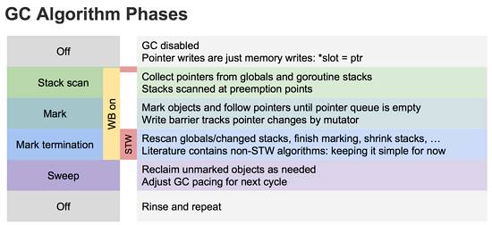

# Go gc(Garbage collector)

## 概念
GC与mutator线程并行运行,允许多个GC线程并行运行。它是一个使用写屏障的并发标记和扫描。它是非代数和非紧凑的。使用按P分配区域隔离的大小完成分配,以最小化碎片,同时消除常见情况下锁定。

### Mutator
在GC的过程中同时运行的G称为mutator,mutator assist机制就是G辅助GC做一一部分工作的机制。
Mutator 做的工作有两种类型: 

* 标记(mark)
* 清除(Sweep)

### 写屏障(Write barrier)
写屏障主要处理扫描过的对象的状态变化,使用写屏障技术监控这段对象的内存,当对象状态发生改变时,写屏障会发送一个信号,GC会捕获到写屏障的信号。GC就可以知道这个对象发生了改变,则GC会重新扫描这个对象,进行状态重置。进行判断这个状态是否存活。

### 根对象(Root)
生命周期可以保证的对象.比如,线程栈(stack内引用的指针)、全局变量等。

### STW优化
在清理阶段GC可以和用户线程并发执行,因为回收的是那些标记为白色没有被引用的对象(不会被线程栈、全局变量引用)。清理操作可以被并发,进而缩短STW时间。

扫描阶段通过写屏障技术可以在一定程度上减少STW时间。

## 三色清理标记原理概述
* 起初所有对象都是白色。
* 扫描所有可达对象,标记为灰色,放入待处理队列。
* 从队列提取灰色对象,将其引用对象标记为灰色放入待处理队列,将自己标记为黑色放入队列。
* 写屏障监控对象内存修改,从新标色或放入队列。

当完成所有的扫描和标记的工作后,剩下不是白色就是黑色。分别代表要回收和活跃对象,清理操作只需要把白色对象回收。

### 三色清理标记算法详细步骤

#### GC清除终止 

* Stop the world(STW),所有线程停止运行,所有P处于GC安全点。
* 清理所有未清理的spans,如果在预期时间之前强制执行GC循环,则仅清理未清理的spans。

#### 标记阶段(第一阶段)
* 准备标记阶段(通过gcphase设置为_GCmark)。启动写屏障,启用mutator assist,并对根对象放入队列, 准备标记。(在所有P启动写屏障之前,不会扫描任何对象,这是使用STW完成的)
* Start the world,从现在开始,GC的标记和分配的一部分执行辅助工作完成。写屏障将覆盖指针和新指针着色,新分配的对象会被标记为黑色。
* GC执行根标记, 扫描所有stacks。着色所有全局变量以及堆外runtime数据结构中的任何堆指针。扫描stack时会停止当前goroutine,着色在当前stack扫描到的任何指针,然后恢复goroutine 运行。
* 从队列提出灰色对象,将其引用对象标记为灰色放入待处理队列,将自己标记为黑色放入队列。

#### 标记阶段(第二阶段) - Central cache为空,但Mcache不为空
* GC停止所有Worker,禁用本地工作队列缓存(mcache),将每个P的mcache缓存刷新到全局队列缓存(Central cache),并重新启用工作程序。
* GC再次放入队列,等待被调度(第一标记阶段)。

#### 工作队列为空后,GC标记终止
* Stop the world(stw)。
* 将gcphase设置为_GCmarktermination,禁止工作和mutator assist。
* 从工作队列中获取剩余的工作(通常没有)。
* 执行其它内务工作,如清理mcaches。

#### GC清除阶段
* 将gcphase设置为_GCoff,设置清除状态并禁用写屏障。准备进行清除阶段。
* Start the world。从现在开始,新分配对象为白色,并在必要时在使用前分配扫描范围。
* GC在后台进行并发清除并进行内存分配。

#### GC触发
 * 当分配了足够内存堆内存空间时,重新从步骤1开始执行。
 
 

## 并发清理

* 清理阶段与正常程序同时执行。当涉及到跨多个span(当goroutine需要另一个span时)并且同时在后端goroutine中扫描(这有助于不受cpu限制)。在STW标记终止结束时,所有spans都标记为"需要清理"。
* 背景清除goroutine串行一个接一个地清除span。
* 为了避免在有未清理spans的情况下请求更多的操作系统内存,当goroutine需要另一个span时,它首先尝试通过清理来回收更多内存进行复用。当goroutine需要分配一个小对象span时,它会清理相同对象大小的span,直到它释放一个对象。当goroutine需要从堆中分配大对象span时,它会清理span,直到它将至少那么多页释放到堆中。有一种情况,可能不能够使用: 如果goroutine清除并释放两个不相邻的单页span到堆。它将分配一个新的两页span,但仍然可以有其它单页未清除span,可能是合并为两页span。
* 确保在未清除的span上不进行任何操作(这会破坏GC位图中的标记位)至关重要。在GC期间,所有mcache都被刷新到Central cache,因此它们是空的。当goroutine获取了一个新的span到mcache时,GC会扫描它。当goroutine显示释放对象或设置终结器时,它确保是被清除的span(通过清除它,或等待并发清除完成)。只有当所有span都被清理过时,终结器goroutine才会被踢掉。当下一个GC开始时,它清除所有尚未清除的span。

## GC Rate
下一次GC是在我们已经分配了与已经使用的量成比例的额外内存量之后。该比例由GOGC环境变量控制(默认值为100)。比如: GOGC=100并且我们使用4M,那么当我们达到8M时,我们将再次使用GC(此标记在next_gc变量中被跟踪)。

这种方式是不是感觉比较笨～～ 吐槽！ 不够智能～

## Oblets
为了防止在扫描大对象时出现长时间暂停并提高并行性,垃圾收集器将大于maxObletBytes的对象的扫描分解为最多maxobletBytes的"oblets"。当扫描遇到大对象时,它只扫描第一个oblet并将剩余的oblet列为新的扫描任务。

### Oblets 来源
oblets是Tcl语言的一个非常简单的对象系统,对象数据存储在全局数组中。

