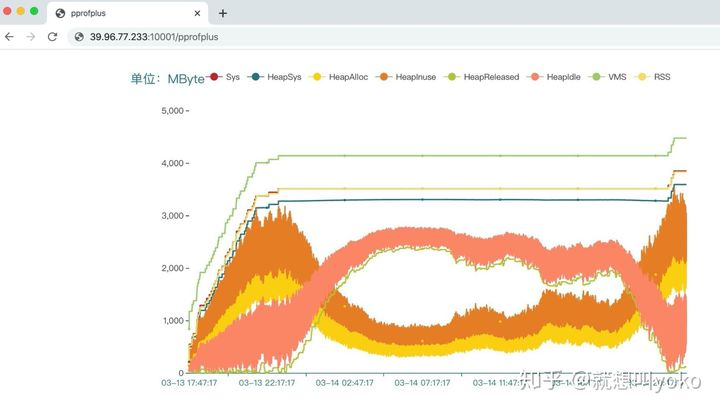

# [摘录] Go 进程的HeapReleased上升，但是RSS不下降造成内存泄漏?

事情是这样的，线上一个服务，启动后 RSS 随任务数增加而持续上升，但是过了业务高峰期后，任务数已经下降，RSS 却没有下降，而是维持在高位水平。

那内存到底被谁持有了呢？为了定位问题，我把进程的各项 Go runtime 内存指标，以及进程的 RSS 等指标持续采集下来，并以时间维度绘制成了折线图：

> 本着 DRY 原则，我把采集和绘制部分专门制作成了一个开源库，业务方代码可以十分方便的接入，绘制出如上样式的折线图，并通过网页实时查看。https://github.com/q191201771/pprofplus

图中的指标，VMS 和 RSS 是任何 linux 进程都有的。Sys、HeapSys、HeapAlloc、HeapInuse、HeapReleased、HeapIdle 是 Go runtime 记录的内存情况。

* VMS 和 RSS 的含义可以看这篇：[[译] linux内存管理之RSS和VSZ的区别](https://pengrl.com/p/21292/)
* Go runtime 中的指标含义可以看这篇：[Go pprof内存指标含义备忘录](https://pengrl.com/p/20031/)

&nbsp;

简单来说，RSS 可以认为是进程实际占用内存的大小，也是一个进程外在表现最重要的内存指标。HeapReleased 是 Go 进程归还给操作系统的内存。在[如何分析golang程序的内存使用情况
](https://pengrl.com/p/24169/)这篇老文章中，实验了随着垃圾回收，HeapReleased 上升，RSS 下降的过程。

&nbsp;

但是这次的案例，从图中可以看到，HeapReleased 上升，RSS 却从来没有下降过。。

我们来具体分析。（以下我就不重复解释各指标的含义了，对照着看上面那两篇文章就好）

首先从业务的任务数来说，从启动时间 `03-13 17:47:17` 开始，是持续增长的，到 `22:17:17` 之后开始下降，再到 `03-14 16:17:27` 之后，又开始上升。之后就是循环反复。这是业务上实际内存需求的特点。

* VMS 和 RSS 的整体波形一致，维持在一定差值，符合预期。
* Sys 和 RSS 几乎重叠，说明确实是 Go 代码使用的内存，符合预期。
* HeapSys 和 Sys 的波形一致，维持在一个比较小的差值，说明大部分内存都是堆内存，符合预期。
* HeapInuse 和 HeapAlloc 是持续震荡的，波形一致，维持在一定差值，业务高峰期时上升，低峰期下降，符合预期。
* HeapIdle 在首次高峰前震荡上升，之后一直和 HeapInuse 的波形相反，说明起到了缓存的作用，符合预期。
* HeapIdle 和 HeapReleased 波形一致，符合预期。

&nbsp;

那么回到最初的问题，为什么 HeapReleased 上升，RSS 没有下降呢？

这是因为 Go 底层用[mmap](https://www.man7.org/linux/man-pages/man2/mmap.2.html)申请的内存，会用[madvise](https://man7.org/linux/man-pages/man2/madvise.2.html)释放内存。具体见`go/src/runtime/mem_linux.go`的代码。

madvise 将某段内存标记为不再使用时，有两种方式 `MADV_DONTNEED` 和 `MADV_FREE` （通过标志参数传入）：

* `MADV_DONTNEED`：标记过的内存如果再次使用，会触发缺页中断
* `MADV_FREE`：标记过的内存，内核会等到内存紧张时才会释放。在释放之前，这块内存依然可以复用。这个特性从 `linux 4.5` 版本内核开始支持

&nbsp;

显然，`MADV_FREE` 是一种用空间换时间的优化。

* 在 `Go 1.12` 之前，linux 平台下 Go runtime 中的`sysUnsed`使用`madvise(MADV_DONTNEED)`
* 在 `Go 1.12` 之后，在 `MADV_FREE` 可用时会优先使用 `MADV_FREE`

具体见: [#23687](https://github.com/golang/go/issues/23687)

`Go 1.12` 之后，提供了一种方式强制回退使用 `MADV_DONTNEED` 的方式，在执行程序前添加`GODEBUG=madvdontneed=1`。具体见：[#28466](https://github.com/golang/go/issues/28466)

ok，知道了 RSS 不释放的原因，回到我们自己的问题上，做个总结。

事实上，我们案例中，进程对执行环境的资源是独占的，也就是说机器只有这一个核心业务进程，内存主要就是给它用的。

所以我们知道了不是自己写的上层业务错误持有了内存，而是底层做的优化，我们开心的用就好。

另一方面，我们应该通过 HeapInuse 等指标的震荡情况，以及 GC 的耗时，来观察上层业务是否申请、释放堆内存太频繁了，是否有必要对上层业务做优化，比如减少堆内存，添加内存池等。

摘录: [知乎_非常程序员](https://zhuanlan.zhihu.com/p/114340283)