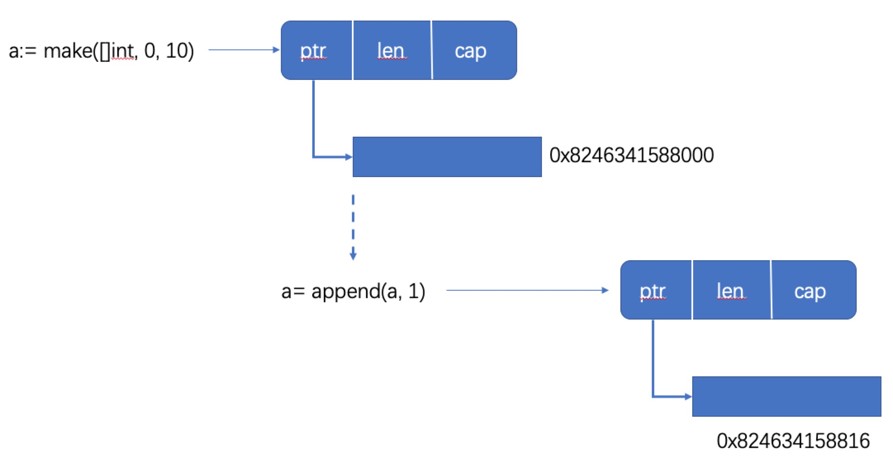

# slice
slice问题汇总，主要汇总一些比较坑的知识点。


### append
slice数据类型由两部分组成,sliceHeader和底层数组两部分组成。slice在进行append时，当cap容量不够用时，才会调用growslice函数进行内存扩容，扩容后，将旧slice内容拷贝到新slice。

扩容时，如果旧slice len小于1024,扩容后的slice cap大小为新slice cap 2倍；如果旧的slice len 大于1024，则扩容后的cap1/4的比例增涨。
#### 实例1

```
package main

import (
	"fmt"
	"unsafe"
	"reflect"
)

func main() {
	a := make([]int, 0, 10)
	a = append(a, 1)
	
	println(&a)    // a slice header 内存地址
	p := *(*reflect.SliceHeader)(unsafe.Pointer(&a))
	fmt.Println(p) // a slice header 内存,包括底层数组指针
	
	a = append(a, 2)
	a = append(a, 2)
	a = append(a, 2)
	a = append(a, 2)
	a = append(a, 2)
	a = append(a, 2)
	println(&a)
	p = *(*reflect.SliceHeader)(unsafe.Pointer(&a))
	fmt.Println(p)
	
	
	a = append(a, 2)
	println(&a)
	p = *(*reflect.SliceHeader)(unsafe.Pointer(&a))
	fmt.Println(p)
}
```

输出:

```
第一次输出:
0xc000076f70          // a 变量地址
{824634294272 3 10}   // a header struct

第二次输出:
0xc000076f70          // a 变量地址
{824634294272 3 10}   // a header struct


第三次输出: 此时slice 发生了扩容,header ptr指向的底层数组内存地址发生了改变。
0xc000076f70          // a 变量地址
{824634207968 4 10}   // a header struct
```

输出结果看出:

1. append之后还是赋值给变量a,所以a地址保持不变。
2. append之后, 当cap空间不足时，a ptr指向底层数组内存空间发生了变化。




#### 实例2
append之后赋值给一个新变量。此时，slice header ptr指针和旧slice header ptr指向同一底层数组。

```
package main

import (
        "fmt"
        "unsafe"
        "reflect"
)

func main() {
	a := make([]int, 2, 10)
    a = append(a, 1)

    println(&a)
    p := *(*reflect.SliceHeader)(unsafe.Pointer(&a))
    fmt.Println(p, a)

    b := append(a, 1)
    println(&b)
    p = *(*reflect.SliceHeader)(unsafe.Pointer(&b))
    fmt.Println(p, b)

    c := append(b, 1)
    println(&c)
    p = *(*reflect.SliceHeader)(unsafe.Pointer(&b))
    fmt.Println(p, c)
}
```

输出:

```
0xc000076ec8                  // 变量a
{824634294272 3 10} [0 0 1]

0xc000076eb0                  // 变量b
{824634294272 4 10} [0 0 1 1]

0xc000076e98                  // 变量c
{824634294272 4 10} [0 0 1 1 1]
```

输出结果看出,append之后赋值的新变量地址发生了变化。而三个变量指向的底层数组地址没有发生变化(slice不会发生扩容情况下)。

