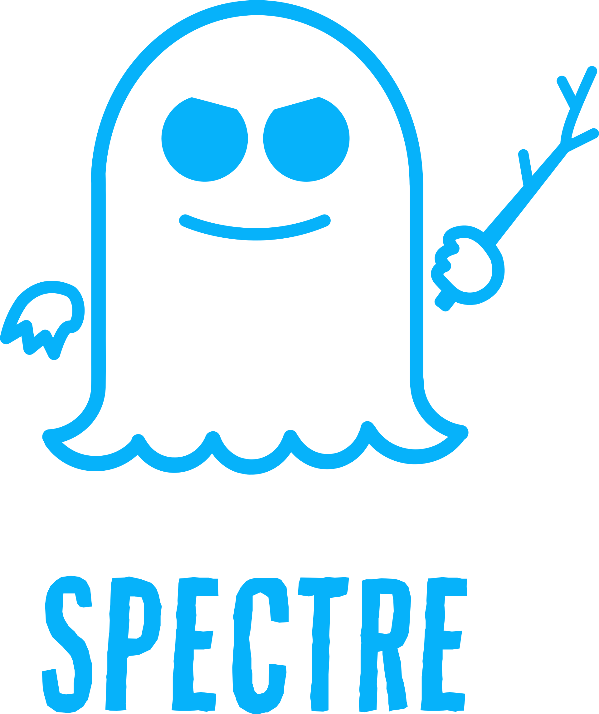

# Go1.15

目前Go1.15还未正式发布，主要更新目前已经发出来的Go1.15 beta1版本。


## Tools

### Go Command

GOPROXY支持跳过错误的Go代理服务器。

### Flag parsing
修复了go test和go vet标志的解析问题。 Eg: -outputdir指定相对路径时,相对与Go项目工作目录而不在是每个测试的工作目录。

### Module cache
现在使用GOMODCACHE环境变量可以设置module缓存路径，默认是${GOPATH}/pkg/mod目录。


## Vet
vet是一个优雅的工具，每个Go开发者都要知道并会使用它。它会做代码静态检查发现可能的bug或者可疑的构造。

### New warning for string(x)
在Go语言中如果使用string(int number)将一个整形转换成字符串会有问题。在1.15版本这样使用会有告警提示,未来编译器会禁止这种方式的转换。

* 实例
string(9786)的计算结果不为字符串"9786"；计算结果为字符串"\xe2\x98\xba"或"☺"。

以下是正确的使用方式:

```
string(rune(x))
utf8.EncodeRune(buf, x)
strconv.Itoa
fmt.Sprint
```

### New warning for impossible interface conversions

新增了两个不同interface转换告警提示。比如两个接口实现了两个相同类型但不同签名的struct,会出现该问题。

go test默认开启了该告警检查。

go team正考虑优化编译器，禁止这种接口的声明，以提升语言的标准和规范。

## Runtime

### panic输出优化
以下类型再调用panic时会输出该值,不像以前只输出VA地址。

```
bool, complex64, complex128, float32, float64, int, int8, int16, int32, int64, string, uint, uint8, uint16, uint32, uint64, uintptr
```

以前，这只适用于这些类型的值。

### Unix信号处理优化
在UNIX系统上，之前如果使用kill命令或者kill系统调用(SIGSEGV, SIGBUS, SIGFPE信号)发送给Go程序，该信号为通过os/signal处理，这会导致无法捕获stack相关信息。现在Go可以获取SIG信号stack信息，可以对崩溃的stack进行跟踪。

### 小对象内存分配优化

在多核心CPU架构下，Go小对象分配执行的更好，并且最坏情况下降低了分配延迟。

> 备注:
具体的优化策略,需要分析源代码之后再进行补充。

### 小整数转interface优化

将小整数值转换为接口值不再导致分配。

### Non-blocking channel优化

Non-blocking channel在关闭channel时性能和Non-blocking channel打开channel时性能相同。

## Compiler

### unsafe
unsafe.Pointer可以将指针转换为unitptr,在某系情况下可能会发生多次转换(syscall.Syscall(..., uintptr(uintptr(ptr)), ...))。现在只需要一次转换即可。

### 编译器优化
与Go1.14对比，Go1.15删除了某些类型GC元数据和未使用的类型元数据。与Go1.14相比编译生成后的二进制文件减少了大约5%。

### 修复Intel SKX12错误
通过将函数32位边界对齐和填充跳转指令，修复GOARCH=amd64架构下intel CPU erratum skx102问题。

#### Intel SLX12错误概述(跳过条件代码错误)
从第二代智能英特尔®酷睿™处理器和英特尔®至强® E3-1200系列处理器（前身为代号为 Sandy Bridge）和更高版本的处理器家族开始，英特尔®微架构引入了一个名为解码ICache（也称为解码的流式缓冲区或 DSB）。

解码后的ICache缓存解码指令，称为微 ops（μops），它从旧解码管道中弹出。当处理器下一次访问相同的代码时，解码ICache直接提供μops，从而加快程序执行速度。在某些英特尔®处理器中，有一个错误（SKX102）在复杂的微架构条件下发生，这些情况涉及跨越跨64字节界限（交叉缓存线）的跳转指令。 微代码更新（MCU）可防止此错误。

有关此错误的详细信息，包括如何获取MCU和处理器家族/处理器编号系列的列表，请查看 "跳转条件代码错误" 的缓解措施。

### Spectre安全漏洞缓解
Go1.15在编译器和汇编器添加了-spectre标志，开启spectre缓解。

#### spectre(幽灵)
Spectre是一个可以迫使用户操作系统上的其他程序访问其程序电脑存储器空间中任意位置的漏洞。是一个存在于分之预测实现中的硬件缺陷及安全漏洞，含有预测执行功能的现代微处理器均受其影响，漏洞利用是基于时间的旁路攻击，允许恶意进程获得其他程序在映射内存中的数据内容。



### 取消go编译器指令
现在编译器取消了//go无用的编译器指令。使用该指令会触发"misplaced compiler directive"错误。编译器会将这种错误忽略掉。

## Linker
Go1.15版本对链接器进行了重大的改进，减少了链接器资源的使用(时间和内存)，并提高了代码的健壮性/可维护性。

AMD64架构的ELF文件，链接速度提升了20%，平均需要内存减少了30%。

提高链接器性能关键是重新设计的文件对象格式，以及改进内部结构以提升并发性(例如,并行地对符号应用重定位)。在Go1.15中对象文件比Go1.14稍微大些。

这些改变是使Go链接器现代化的多版本项目的一部分，意味着未来的版本中将会有额外的链接器改进。

## Objeump
objdump支持-gnu标志的GNU汇编语法的反汇编。


## Core library

### New embedded tzdata package
Go1.15包含了一个新的包"time/tzdata"，该package允许将时区数据嵌入程序中。导入该软件包，及时本地系统上没有时区数据库，该程序也可以查找到时区信息。

### CGo
Go 1.15将C类型的CGLConfig转换为Go类型的uintptr。

### Minor changes to the library

略...

