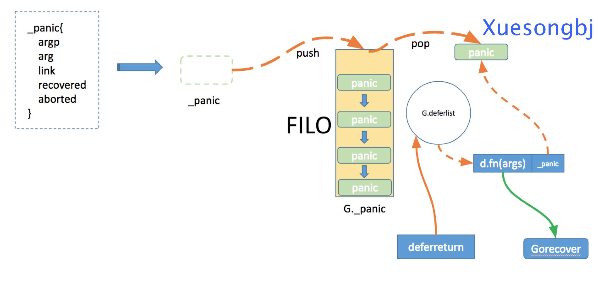

# panic

当程序中发生不可恢复的错误时,可以使用panic进行处理。

Go语言中编译器将panic翻译成gopanic函数进行调用。将panic放到G._panic链表,然后遍历执行G._defer链表,检查是否有recover。被recover,终止遍历执行,跳转到defer正常的deferreturn。否则执行整个调用堆栈的延迟函数。


## Panic scope



## Panic 实现

### Panic 数据结构

```go
// _ panic 保存在当前调用堆栈上
type _panic struct {
     argp      unsafe.Pointer // 最顶层延迟函数调用的参数指针
     arg       interface{}    // panic参数
     link      *_panic        // 下一个panic
     recovered bool           // 是否已经在recover内执行
     aborted   bool           // panic是否被终止
}
```

### gopanic实现

```go
func gopanic(e interface{}) {
     gp := getg()

     // 新创建_panic,挂到G._panic列表头部
     var p _panic
     p.arg = e             // panic 参数
     p.link = gp._panic    // 上一个panic
     gp._panic = (*_panic)(noescape(unsafe.Pointer(&p)))    // _panic linked list

     for {
         d := gp._defer
         if d == nil {
             break
         }

         // 1. 如果defer已经被执行,继续执行下一个defer
         // 2. 已经执行过的defer,内存进行释放
         if d.started {
             if d._panic != nil {
                 // 当前panic是已经终止的panic
                 d._panic.aborted = true
             }
             d._panic = nil
             d.fn = nil
             gp._defer = d.link   // 当前defer从G.deferlist移除
             freedefer(d)
             continue
         }

         // defer暂时不从G.deferlist移除,便于traceback输出所有的调用堆栈信息
         d.started = true

         // 如果defer被执行时,产生新的panic,终止当前panic.
         // 将产生的_panic保存到defer._panic
         d._panic = (*_panic)(noescape(unsafe.Pointer(&p)))


         // 执行defer函数
         // p.argp地址很重要,defer里的recover以此来判断是否直接在defer内执行
         // reflectcall 会修改p.argp
         p.argp = unsafe.Pointer(getargp(0))
         reflectcall(nil, unsafe.Pointer(d.fn), deferArgs(d), uint32(d.siz), uint32(d.siz))
         p.argp = nil

         // 将已经执行的defer从G._defer链表删除
         d._panic = nil
         d.fn = nil
         gp._defer = d.link  // 当前defer从G.deferlist移除

         // 使用defer stack信息,这也是为什么不在上面对defer进行释放.
         pc := d.pc
         sp := unsafe.Pointer(d.sp) // must be pointer so it gets adjusted during stack copy
         freedefer(d)               // defer 内存释放

         // 如果该defer内执行了recover,那么recovered=true
         if p.recovered {
             // 移除当前recovered panic
             gp._panic = p.link

             // 移除aborted panic
             for gp._panic != nil && gp._panic.aborted {
                 gp._panic = gp._panic.link
             }

             // 现场恢复,继续执行剩余的defer
             // recovery跳转defer.pc(调用deferproc时的IP寄存器),也就是deferproc后.
             // 编译器调用deferproc后插入比较指令,通过标志判断,跳转到deferreturn执行剩余的defer函数
             gp.sigcode0 = uintptr(sp)
             gp.sigcode1 = pc
             mcall(recovery)
             throw("recovery failed") // mcall should not return
         }

         // 如果没有recovered,那么循环执行整个调用堆栈的延迟函数
     }
}
```

### recover 具体实现

```
// 1. gorecover stack不能被拆分,因为需要根据它找到调用者的stack.
// 2. Go team 将来会通过每次拷贝gorecover栈帧方式取消nosplit.
// go:nosplit
func gorecover(argp uintptr) interface{} {
     // 当前调用堆栈panic
     gp := getg()
     p := gp._panic

     // p.argp是最顶层延迟函数调用的参数指针.
     if p != nil && !p.recovered && argp == uintptr(p.argp) {
         p.recovered = true
         return p.arg
     }
     return nil
}
```